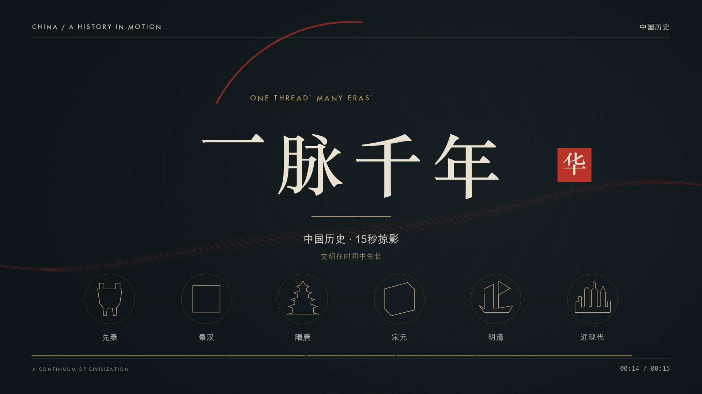

# One Thread, Many Eras · 一脉千年

An original **15-second motion graphic about Chinese history**, with kinetic typography, transforming silhouettes, cinnabar transitions, and an original pentatonic score.

[](china-in-motion.mp4)

## Watch

- **[Open / download the MP4](china-in-motion.mp4)** — 1920 × 1080, 30 fps, H.264 + stereo AAC, 15.00 seconds.
- **[View the storyboard](storyboard.jpg)** for the six eras and closing composition.
- Download or clone this repository and open `index.html` in Chrome. Keep the video and poster beside the HTML file.

## Structure

| Time | Era | Theme |
| --- | --- | --- |
| 00–02 s | Pre-Qin | The birth of civilization |
| 02–04 s | Qin / Han | Unification |
| 04–06 s | Sui / Tang | Openness and exchange |
| 06–08 s | Song / Yuan | Knowledge in circulation |
| 08–10 s | Ming / Qing | Voyages and changing times |
| 10–12 s | Modern and contemporary | Transformation |
| 12–15 s | Closing title | One thread, many eras |

Bronze, seals, architecture, printing blocks, sails, and city silhouettes are contemporary design interpretations of the eras.

## Render

Requires Python 3.10+ and macOS fonts: **Songti, Arial Unicode, Futura, Menlo**. Paths are defined in `render.py`; on other systems, substitute locally installed fonts with Chinese character support. Font files are not included.

```sh
python3 -m venv .venv
source .venv/bin/activate
python -m pip install -r requirements.txt
python render.py --stills
python render.py
```

Pillow and NumPy generate the graphics and original audio; the FFmpeg binary supplied by `imageio-ffmpeg` encodes the video. Composition and sound generation code are in `render.py`.

## Files

- `china-in-motion.mp4` — finished film.
- `index.html`, `poster.jpg`, `storyboard.jpg` — player and previews.
- `render.py`, `requirements.txt` — source and dependencies.
- `original-score.wav` — original stereo score.
- `manifest.json` — specifications and chapter timings.

<details>
<summary>中文翻译</summary>

## 一脉千年

一支 15 秒的中国历史动态图形短片。以动态文字、轮廓变形、朱砂转场和原创五声音阶配乐，串起六个时代。

### 查看

- **[打开或下载成片 MP4](china-in-motion.mp4)**：1920 × 1080、30 帧、H.264 视频与立体声 AAC 音频，时长 15.00 秒。
- **[查看分镜总览](storyboard.jpg)**：六个时代与片尾构图。
- 下载或克隆整个仓库后，用 Chrome 打开 `index.html`。视频、封面与播放页须保存在同一目录。

### 结构

| 时间 | 时代 | 主题 |
| --- | --- | --- |
| 00–02 秒 | 先秦 | 文明初生 |
| 02–04 秒 | 秦汉 | 山河一统 |
| 04–06 秒 | 隋唐 | 开放交融 |
| 06–08 秒 | 宋元 | 知识流转 |
| 08–10 秒 | 明清 | 远航与变局 |
| 10–12 秒 | 近现代 | 变革新生 |
| 12–15 秒 | 片尾 | 一脉千年 |

青铜、印章、楼阁、活字、帆船和城市，均为对应时代意象的当代设计演绎。

### 重新渲染

需要 Python 3.10+，以及 macOS 的宋体、Arial Unicode、Futura 和 Menlo 字体。字体路径集中在 `render.py`；其他系统可替换为本机字体，中文部分须支持汉字。仓库不包含字体文件。

按上方命令安装依赖，运行 `python render.py --stills` 生成预览，再运行 `python render.py` 导出视频。

图形与音频通过 Pillow 和 NumPy 生成，视频编码使用 `imageio-ffmpeg` 提供的 FFmpeg。全部构图和声音合成源码都在 `render.py` 中。

### 文件

- `china-in-motion.mp4`：成片。
- `index.html`、`poster.jpg`、`storyboard.jpg`：播放页、封面与分镜。
- `render.py`、`requirements.txt`：源码与依赖。
- `original-score.wav`：原创立体声配乐。
- `manifest.json`：视频规格、帧数、时长与分段信息。

</details>
